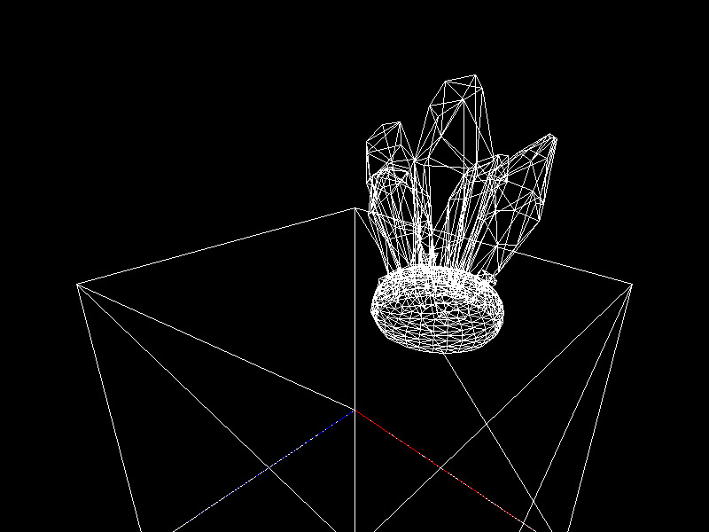

# 3d-renderer

> A CUDA-based raytracer that supports textures, diffuse lighting, and shadow rays.

---

## Features

- Ray-triangle intersection using Möller–Trumbore algorithm  
- Diffuse lighting with multiple light sources  
- Shadow ray calculations for occlusion  
- Texture mapping on meshes  
- Output in wireframe, solid, and fully rendered modes  

---


## Preview

### Wireframe


### Solid


### Full Render


---

## Build & Run

```bash
mkdir build
cd build
cmake ..
make
./your_executable_name
```

main.cpp show you example of usage
